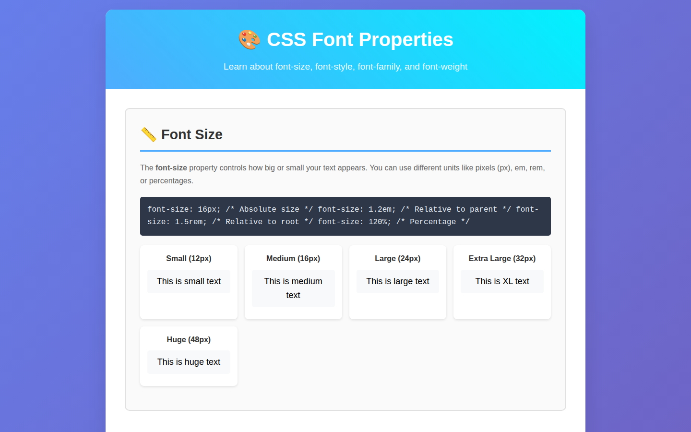

# CSS Font Properties — Learning Guide

A one-page guide for students learning CSS typography, with code samples and live examples for each font property.

## What's inside

- Sections for font-size, font-style, font-family, and font-weight
- Code snippets next to rendered examples
- Interactive font demo

## Built with

- HTML
- CSS

## Run locally

No build step. Open `index.html` in a browser.
